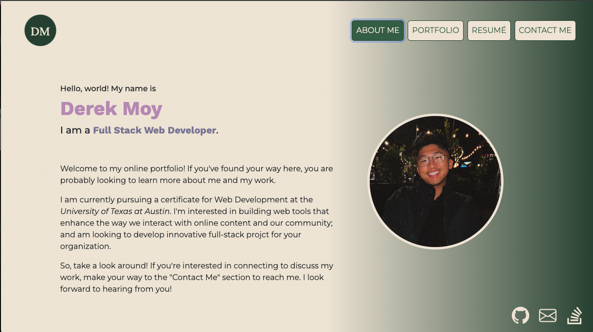
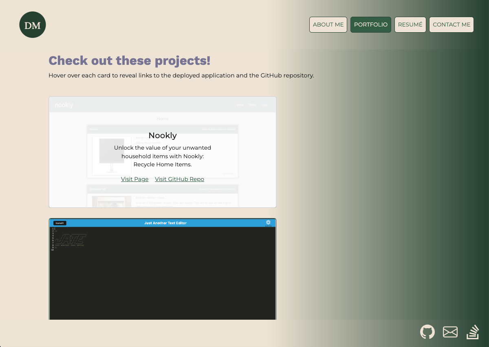
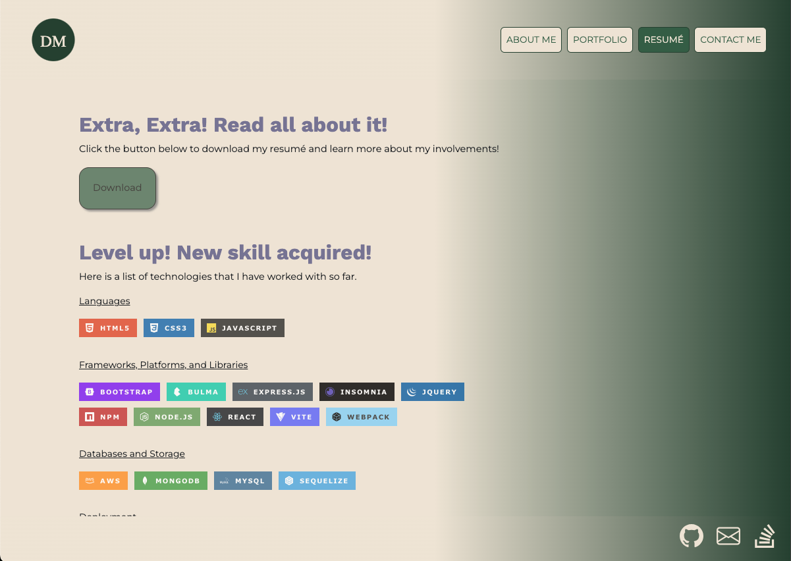
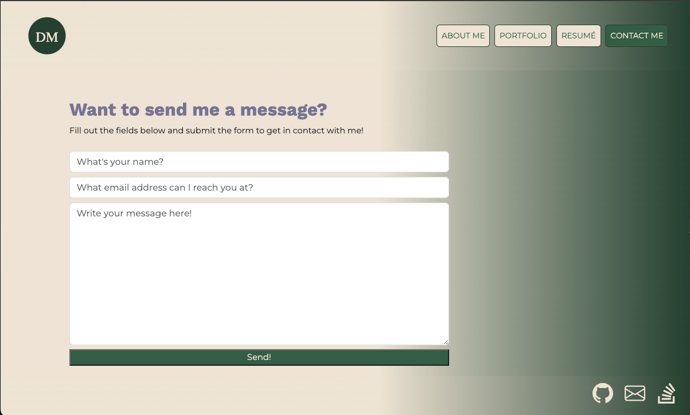

# React Portfolio

## Description 

Hello, world! Welcome to my online portfolio. I've build this website to introduce myself and highlight my journey as a Full Stack Web Developer thus far.

My webpage is split into 4 major sections: About Me, Porfolio, Resume, and Contact Me. These pages present vistors with a a small summary of myself, some of my highlighted projects, my resume and skills, as well as a form to contact me. 

I've created this website using React and Vite, and hosted it on Netlify which you can access [here](https://dymoy.netlify.app/). Take a look around and send me a message if you're interested in connecting! 

## Table of Contents 
- [Installation](#installation)
- [Dependencies](#dependencies)
- [Usage](#usage)
- [Questions](#questions)
  
## Installation 
There is no installation necessary for this application as it is deployed and hosted on [Netlify](https://docs.netlify.com/). You can access my website [here](https://dymoy.netlify.app/) or at the following link: https://dymoy.netlify.app/

If you are interested in running the application locally, please use the following steps:
1. Clone this repository to your local machine. (For reference, visit the [Cloning a Repository](https://docs.github.com/en/repositories/creating-and-managing-repositories/cloning-a-repository) GitHub Docs article.)
2. Run `npm install` in your CLI to download the npm package dependencies.
3. Run `npm run dev` to start up the backend and serve the client.
4. Navigate to `http://localhost:3000` on your local web browser to use the application. 
  
## Dependencies
This project requires the following npm package dependencies, which are included in `package.json`:  

1. [bootstrap](https://getbootstrap.com/docs/4.1/getting-started/introduction/) 
2. [react](https://legacy.reactjs.org/docs/getting-started.html)
3. [react-bootstrap](https://react-bootstrap.netlify.app/)
3. [react-dom](https://legacy.reactjs.org/docs/react-dom.html)
4. [react-router-dom](https://reactrouter.com/en/main)

## Usage 

### About Me Page 
Upon opening my website, the user will be presented with the About Me page by default. It has a short description of myself and a recent photo. The user can navigate to the other pages using the navbar in the header. 

### Portfolio Page
Make your way to the Portfolio page to see my highlighted projects. Users can hover over the cards to see the project name and descriptions.  

Each project card also includes links to the deployed application and the associated GitHub repository. 

### Resumé Page
The Resume page includes a button to download my most recent resume. If the user scrolls further down, they'll be presented with a list of my skill proficiencies.

### Contact Me Page
If the user is interested in contacting me, the Contact Me page includes a form for the user to submit their name, email, and message. 

The form includes a number of validators that prevents the user from submitting a form with empty fields or entering an invalid email address. 

## Questions
This project was developed by [dymoy](https://github.com/dymoy).  
For any related questions, please contact me via email at <derekymoy@gmail.com>.
